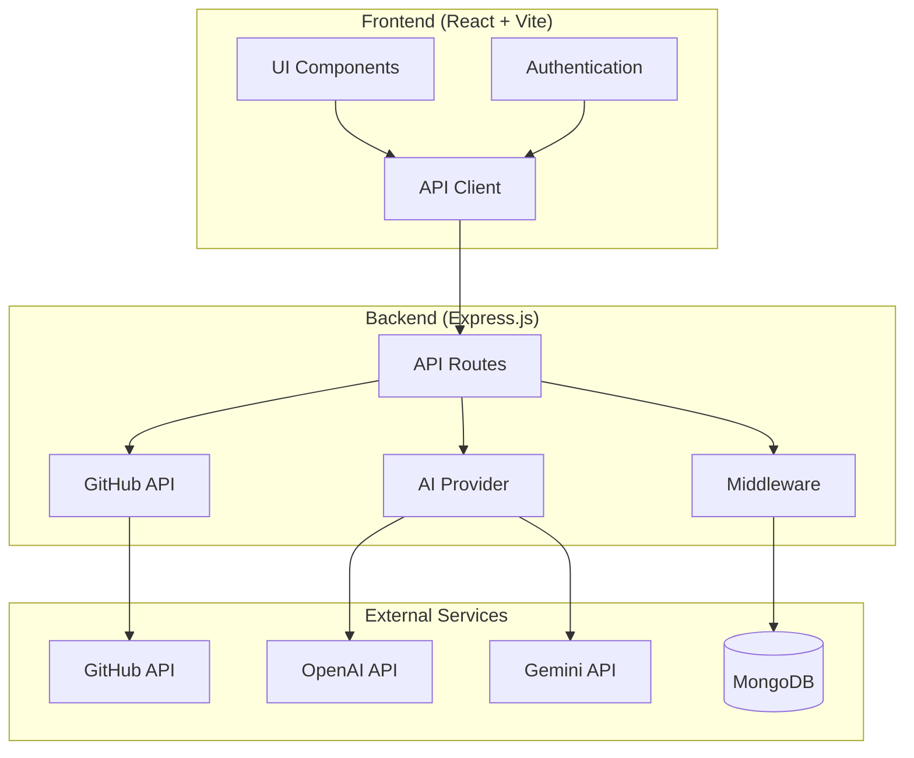

# TestGen

**AI-Powered Test Case Generator for GitHub Repositories**

TestGen is a full-stack application that leverages AI to automatically generate test cases for code files in GitHub repositories. Connect any public repository, browse files, and generate comprehensive test summaries and executable test code.

---

## Table of Contents

- [Overview](#overview)
- [Architecture](#architecture)
- [Features](#features)
- [Tech Stack](#tech-stack)
- [Getting Started](#getting-started)
- [Project Structure](#project-structure)
- [Configuration](#configuration)
- [Documentation](#documentation)
- [License](#license)

---

## Overview

TestGen streamlines the testing workflow by:

1. Connecting to any GitHub repository via URL
2. Browsing and selecting source code files
3. Generating AI-powered test case summaries
4. Creating executable test code in multiple frameworks (Jest, PyTest, JUnit)
5. Saving and versioning test cases for future reference

```
┌─────────────────────────────────────────────────────────────────────┐
│                           TestGen Flow                              │
├─────────────────────────────────────────────────────────────────────┤
│                                                                     │
│   GitHub Repo ──► File Browser ──► AI Analysis ──► Test Generation  │
│                                                                     │
│   ┌─────────┐    ┌─────────┐    ┌─────────┐    ┌─────────────────┐  │
│   │  Input  │───►│  Fetch  │───►│ Analyze │───►│ Generate Tests  │  │
│   │   URL   │    │  Files  │    │  Code   │    │ Jest/PyTest/... │  │
│   └─────────┘    └─────────┘    └─────────┘    └─────────────────┘  │
│                                                                     │
└─────────────────────────────────────────────────────────────────────┘
```

---

## Architecture



---

## Features

| Feature | Description |
|---------|-------------|
| **Repository Connection** | Connect to any public GitHub repository via URL |
| **File Browser** | Browse and search repository files with syntax-aware icons |
| **Code Viewer** | View source code with syntax highlighting |
| **AI Summaries** | Generate comprehensive test case summaries using AI |
| **Multi-Framework Support** | Generate tests for Jest, PyTest, and JUnit |
| **Test Case Versioning** | Save, edit, and restore previous test versions |
| **User Authentication** | Secure JWT-based authentication system |
| **Responsive Design** | Full mobile and desktop support |

---

## Tech Stack

### Frontend
| Technology | Purpose |
|------------|---------|
| React 18 | UI Framework |
| Vite | Build Tool |
| TailwindCSS | Styling |
| React Icons | Icon Library |
| React Syntax Highlighter | Code Display |
| React Toastify | Notifications |

### Backend
| Technology | Purpose |
|------------|---------|
| Node.js | Runtime |
| Express.js | Web Framework |
| MongoDB + Mongoose | Database |
| JWT | Authentication |
| bcryptjs | Password Hashing |
| Axios | HTTP Client |

### AI Providers
| Provider | Model |
|----------|-------|
| OpenAI | GPT-3.5 Turbo |
| Google | Gemini 2.5 Flash |

---

## Getting Started

### Prerequisites

- Node.js 18+
- MongoDB (local or cloud)
- GitHub Personal Access Token (optional, for higher rate limits)
- OpenAI or Gemini API Key (optional, for AI features)

### Installation

```bash
# Clone the repository
git clone https://github.com/your-username/workik-testgen.git
cd workik-testgen

# Install server dependencies
cd server
npm install

# Install client dependencies
cd ../client
npm install
```

### Environment Setup

Create `.env` files based on the examples:

```bash
# Server configuration (server/.env)
PORT=8080
GITHUB_TOKEN=your_github_token
AI_PROVIDER=gemini  # or 'openai' or 'none'
GEMINI_API_KEY=your_gemini_key
JWT_SECRET=your_secret_key
MONGO_URI=mongodb://localhost:27017/workik-testgen
```

### Running the Application

```bash
# Terminal 1: Start the server
cd server
npm run dev

# Terminal 2: Start the client
cd client
npm run dev
```

Access the application at `http://localhost:5173`

---

## Project Structure

```
workik-testgen/
├── client/                    # Frontend application
│   ├── src/
│   │   ├── components/        # React components
│   │   │   ├── Auth/          # Authentication components
│   │   │   ├── Dashboard.jsx  # Main dashboard
│   │   │   ├── FileList.jsx   # File browser
│   │   │   └── ...
│   │   ├── lib/               # Utilities
│   │   ├── icons/             # Custom icons
│   │   └── App.jsx            # Root component
│   └── package.json
│
├── server/                    # Backend application
│   ├── src/
│   │   ├── ai/                # AI provider integrations
│   │   ├── github/            # GitHub API client
│   │   ├── middleware/        # Express middleware
│   │   ├── models/            # MongoDB schemas
│   │   ├── routes/            # API endpoints
│   │   └── index.js           # Server entry point
│   └── package.json
│
└── docs/                      # Documentation
    ├── PRD.md                 # Product Requirements
    ├── API.md                 # API Documentation
    └── LOGICS.md              # System Logic & Diagrams
```

---

## Configuration

| Variable | Required | Description |
|----------|----------|-------------|
| `PORT` | No | Server port (default: 8080) |
| `GITHUB_TOKEN` | No | GitHub PAT for higher rate limits |
| `AI_PROVIDER` | No | 'openai', 'gemini', or 'none' |
| `OPENAI_API_KEY` | If using OpenAI | OpenAI API key |
| `GEMINI_API_KEY` | If using Gemini | Google Gemini API key |
| `JWT_SECRET` | Yes | Secret for JWT signing |
| `MONGO_URI` | Yes | MongoDB connection string |

---

## Documentation

- **[PRD.md](./docs/PRD.md)** - Product Requirements Document
- **[API.md](./docs/API.md)** - Complete API Reference
- **[LOGICS.md](./docs/LOGICS.md)** - System Logic, Flows & UML Diagrams

---

## License

MIT License - see [LICENSE](./LICENSE) for details.
