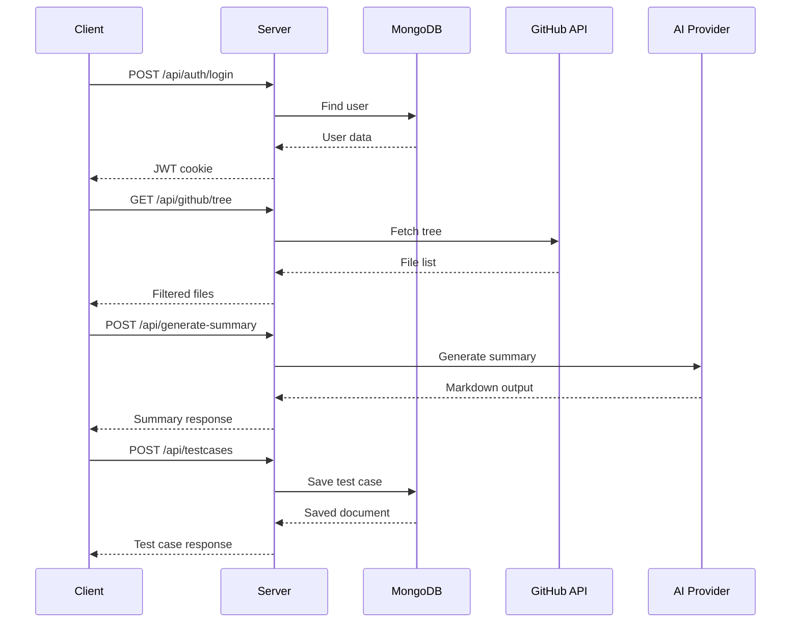

# API Documentation

## TestGen API Reference

**Base URL:** `http://localhost:8080/api`  
**Version:** 1.0  
**Authentication:** JWT (HTTP-only cookie)

---

## Table of Contents

- [Authentication](#authentication)
- [GitHub Integration](#github-integration)
- [AI Generation](#ai-generation)
- [Test Cases](#test-cases)
- [Error Handling](#error-handling)
- [Rate Limits](#rate-limits)

---

## Request/Response Format

```
┌─────────────────────────────────────────────────────────────────────┐
│                     API Request Flow                                │
├─────────────────────────────────────────────────────────────────────┤
│                                                                     │
│  Client ──► Request ──► Auth Middleware ──► Route Handler ──► DB   │
│                              │                    │                 │
│                              ▼                    ▼                 │
│                         JWT Verify          GitHub/AI APIs          │
│                                                                     │
│                              │                    │                 │
│                              └────────┬───────────┘                 │
│                                       ▼                             │
│                                   Response                          │
│                                                                     │
└─────────────────────────────────────────────────────────────────────┘
```

All requests must include:
```
Content-Type: application/json
```

Protected routes require authentication cookie or header:
```
Cookie: token=<jwt_token>
Authorization: Bearer <jwt_token>
```

---

## Authentication

### Sign Up

Creates a new user account.

```http
POST /api/auth/signup
```

**Request Body:**
```json
{
  "email": "user@example.com",
  "password": "securepassword"
}
```

**Response:** `200 OK`
```json
{
  "user": {
    "id": "507f1f77bcf86cd799439011",
    "email": "user@example.com"
  }
}
```

**Errors:**
| Status | Error |
|--------|-------|
| 400 | Email and password required |
| 400 | Email already registered |

---

### Login

Authenticates a user and sets JWT cookie.

```http
POST /api/auth/login
```

**Request Body:**
```json
{
  "email": "user@example.com",
  "password": "securepassword"
}
```

**Response:** `200 OK`
```json
{
  "user": {
    "id": "507f1f77bcf86cd799439011",
    "email": "user@example.com"
  }
}
```

**Headers Set:**
```
Set-Cookie: token=<jwt>; HttpOnly; SameSite=Lax
```

**Errors:**
| Status | Error |
|--------|-------|
| 400 | Invalid credentials |

---

### Logout

Clears the authentication cookie.

```http
POST /api/auth/logout
```

**Response:** `200 OK`
```json
{
  "ok": true
}
```

---

### Get Profile

Returns the current authenticated user.

```http
GET /api/auth/profile
```

**Response:** `200 OK`
```json
{
  "user": {
    "_id": "507f1f77bcf86cd799439011",
    "email": "user@example.com",
    "createdAt": "2026-01-01T00:00:00.000Z"
  }
}
```

**Errors:**
| Status | Error |
|--------|-------|
| 401 | No token |
| 401 | Invalid token |
| 404 | User not found |

---

## GitHub Integration

### Get Repository Tree

Fetches the file tree of a GitHub repository.

```http
GET /api/github/tree?owner={owner}&repo={repo}&ref={ref}
```

**Parameters:**
| Param | Type | Required | Default | Description |
|-------|------|----------|---------|-------------|
| owner | string | Yes | - | Repository owner |
| repo | string | Yes | - | Repository name |
| ref | string | No | main | Branch or commit SHA |

**Response:** `200 OK`
```json
{
  "ref": "main",
  "count": 42,
  "files": [
    { "path": "src/index.js", "size": 1234 },
    { "path": "src/utils.js", "size": 567 }
  ]
}
```

**Filtered Extensions:**
`.js`, `.jsx`, `.ts`, `.tsx`, `.py`, `.java`, `.go`, `.rb`, `.php`, `.cs`, `.cpp`, `.c`

**Errors:**
| Status | Error |
|--------|-------|
| 400 | owner and repo are required |
| 500 | GitHub API error |

---

### Get File Content

Retrieves the content of a specific file.

```http
GET /api/github/file?owner={owner}&repo={repo}&path={path}&ref={ref}
```

**Parameters:**
| Param | Type | Required | Default | Description |
|-------|------|----------|---------|-------------|
| owner | string | Yes | - | Repository owner |
| repo | string | Yes | - | Repository name |
| path | string | Yes | - | File path in repo |
| ref | string | No | main | Branch or commit |

**Response:** `200 OK`
```json
"// File content as string\nconst foo = 'bar';\n..."
```

**Errors:**
| Status | Error |
|--------|-------|
| 400 | owner, repo, and path are required |
| 404 | File not found |
| 500 | GitHub API error |

---

## AI Generation

### Generate Code Summary

Generates AI-powered test case summaries for code.

```http
POST /api/generate-summary
```

**Request Body:**
```json
{
  "code": "function add(a, b) { return a + b; }"
}
```

**Response:** `200 OK`
```json
{
  "markdown": "# Unit Test Cases\n\n## Test Scenarios\n- Test addition of positive numbers\n- Test addition of negative numbers\n..."
}
```

**Errors:**
| Status | Error |
|--------|-------|
| 400 | No code provided |
| 500 | AI summary generation failed |

---

### Generate Batch Summaries

Generates summaries for multiple files.

```http
POST /api/ai/summaries
```

**Request Body:**
```json
{
  "owner": "facebook",
  "repo": "react",
  "ref": "main",
  "paths": ["src/index.js", "src/utils.js"]
}
```

**Response:** `200 OK`
```json
{
  "files": [
    {
      "path": "src/index.js",
      "summaries": [
        "Smoke test for exported functions",
        "Error/edge cases for core methods",
        "Integration flow covering main API"
      ]
    }
  ]
}
```

**Errors:**
| Status | Error |
|--------|-------|
| 400 | owner, repo and non-empty paths[] required |
| 500 | Failed to generate summaries |

---

### Generate Test Code

Generates executable test code for a file.

```http
POST /api/ai/generate
```

**Request Body:**
```json
{
  "owner": "facebook",
  "repo": "react",
  "ref": "main",
  "filePath": "src/utils.js",
  "summary": "Test utility functions",
  "framework": "Jest"
}
```

**Response:** `200 OK`
```json
{
  "framework": "Jest",
  "filePath": "src/utils.js",
  "summary": "Test utility functions",
  "code": "import * as Module from './utils';\n\ndescribe('Test utility functions', () => {\n  test('smoke: module loads', () => {\n    expect(Module).toBeTruthy();\n  });\n});"
}
```

**Supported Frameworks:**
| Framework | Output Format |
|-----------|---------------|
| Jest | JavaScript/TypeScript |
| PyTest | Python |
| JUnit | Java |

**Errors:**
| Status | Error |
|--------|-------|
| 400 | owner, repo, filePath, summary required |
| 500 | Generation failed |

---

### Generate Test Cases (Batch)

Generates test code for multiple files.

```http
POST /api/generate-testcases
```

**Request Body:**
```json
{
  "files": [
    {
      "path": "src/utils.js",
      "content": "function add(a, b) { return a + b; }",
      "summary": "Math utilities"
    }
  ],
  "framework": "Jest"
}
```

**Response:** `200 OK`
```json
{
  "results": [
    {
      "path": "src/utils.js",
      "code": "// Auto-generated Jest test...",
      "error": null
    }
  ]
}
```

---

## Test Cases

All test case endpoints require authentication.

### List Test Cases

Returns all test cases for the authenticated user.

```http
GET /api/testcases
```

**Response:** `200 OK`
```json
{
  "testcases": [
    {
      "_id": "507f1f77bcf86cd799439011",
      "user": "507f1f77bcf86cd799439012",
      "filePath": "src/utils.js",
      "framework": "Jest",
      "versions": [
        {
          "code": "// test code...",
          "summary": "Utility tests",
          "createdAt": "2026-01-01T00:00:00.000Z"
        }
      ],
      "createdAt": "2026-01-01T00:00:00.000Z",
      "updatedAt": "2026-01-01T00:00:00.000Z"
    }
  ]
}
```

---

### Get Test Case

Returns a specific test case by ID.

```http
GET /api/testcases/{id}
```

**Response:** `200 OK`
```json
{
  "testcase": {
    "_id": "507f1f77bcf86cd799439011",
    "filePath": "src/utils.js",
    "framework": "Jest",
    "versions": [...]
  }
}
```

**Errors:**
| Status | Error |
|--------|-------|
| 404 | Not found |

---

### Create Test Case

Creates a new test case.

```http
POST /api/testcases
```

**Request Body:**
```json
{
  "filePath": "src/utils.js",
  "framework": "Jest",
  "code": "// test code...",
  "summary": "Utility tests"
}
```

**Response:** `200 OK`
```json
{
  "testcase": {
    "_id": "507f1f77bcf86cd799439011",
    "filePath": "src/utils.js",
    "framework": "Jest",
    "versions": [
      {
        "code": "// test code...",
        "summary": "Utility tests",
        "createdAt": "2026-01-01T00:00:00.000Z"
      }
    ]
  }
}
```

**Errors:**
| Status | Error |
|--------|-------|
| 400 | filePath and code required |

---

### Update Test Case

Adds a new version to an existing test case.

```http
PUT /api/testcases/{id}
```

**Request Body:**
```json
{
  "code": "// updated test code...",
  "summary": "Updated utility tests"
}
```

**Response:** `200 OK`
```json
{
  "testcase": {
    "_id": "507f1f77bcf86cd799439011",
    "versions": [
      { "code": "// original...", "createdAt": "..." },
      { "code": "// updated...", "createdAt": "..." }
    ]
  }
}
```

---

### Delete Test Case

Permanently deletes a test case.

```http
DELETE /api/testcases/{id}
```

**Response:** `200 OK`
```json
{
  "ok": true
}
```

**Errors:**
| Status | Error |
|--------|-------|
| 404 | Not found |

---

### Restore Version

Restores a previous version as the latest.

```http
POST /api/testcases/{id}/restore
```

**Request Body:**
```json
{
  "versionIndex": 0
}
```

**Response:** `200 OK`
```json
{
  "testcase": {
    "_id": "507f1f77bcf86cd799439011",
    "versions": [
      { "code": "// v1...", "createdAt": "..." },
      { "code": "// v2...", "createdAt": "..." },
      { "code": "// v1 restored...", "createdAt": "..." }
    ]
  }
}
```

**Errors:**
| Status | Error |
|--------|-------|
| 400 | Invalid version index |
| 404 | Not found |

---

## Health Check

### Check Server Health

```http
GET /api/health
```

**Response:** `200 OK`
```json
{
  "ok": true
}
```

---

## Error Handling

### Error Response Format

```json
{
  "error": "Error message description"
}
```

### HTTP Status Codes

| Code | Meaning |
|------|---------|
| 200 | Success |
| 400 | Bad Request - Invalid parameters |
| 401 | Unauthorized - Authentication required |
| 404 | Not Found - Resource doesn't exist |
| 500 | Internal Server Error |
| 503 | Service Unavailable - AI provider down |

---

## Rate Limits

### GitHub API

| Type | Limit |
|------|-------|
| Unauthenticated | 60 requests/hour |
| With GITHUB_TOKEN | 5000 requests/hour |

### AI Providers

| Provider | Limit |
|----------|-------|
| OpenAI | Per API key quota |
| Gemini | Per API key quota |

---

## API Architecture


