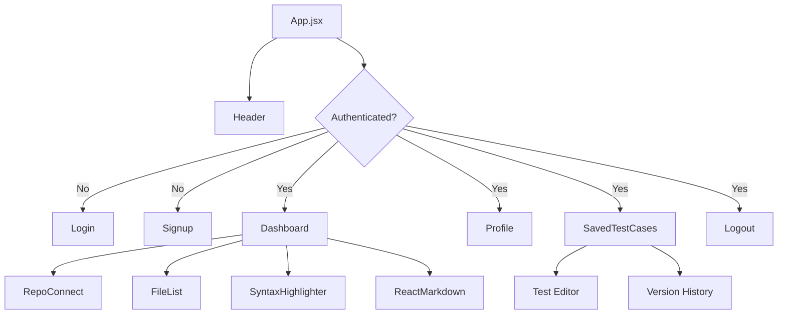
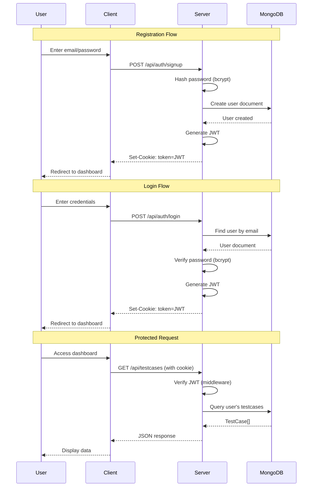
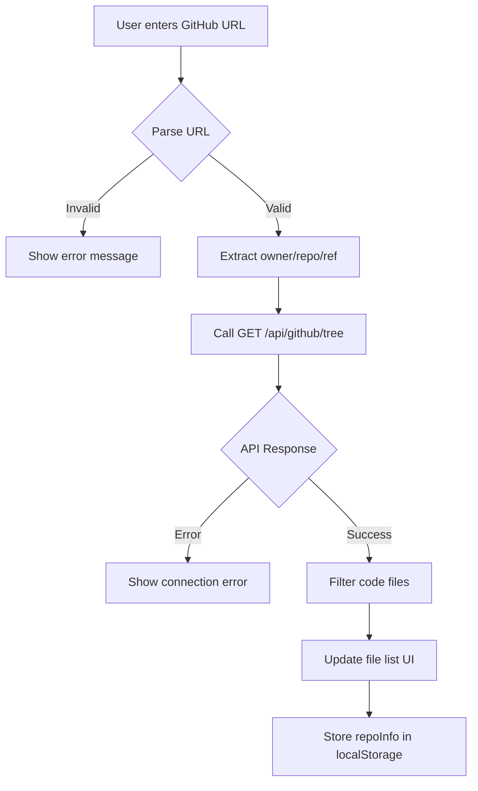
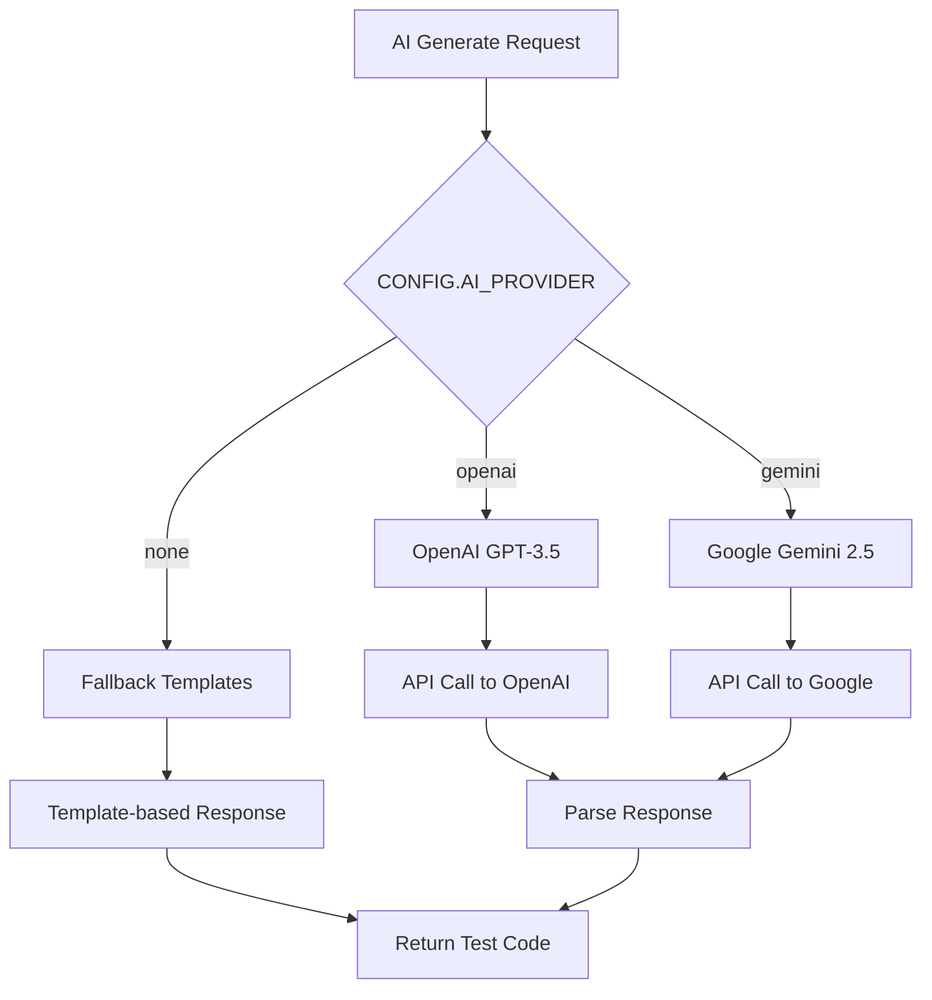
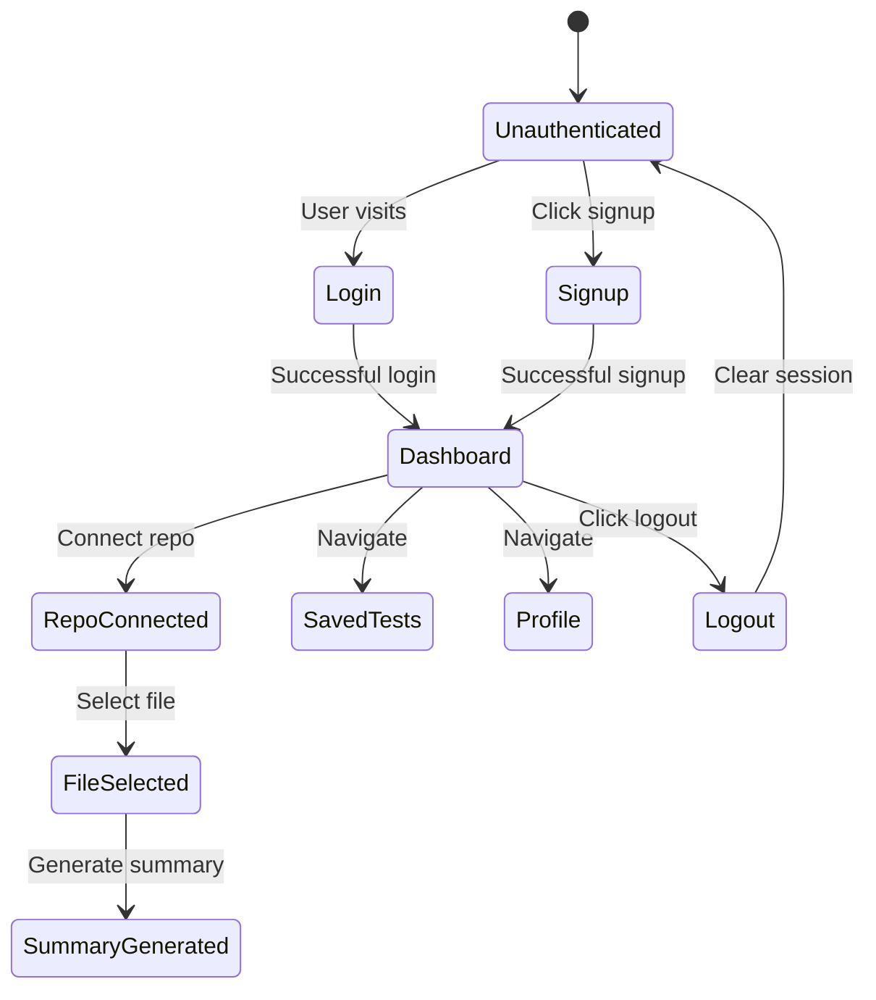
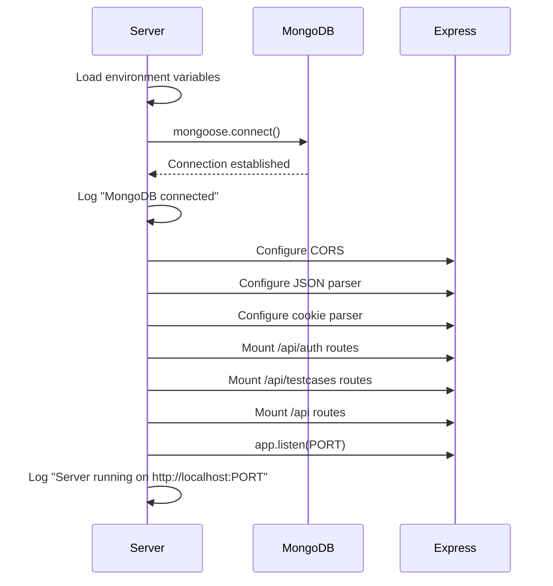

# System Logic & Architecture

## TestGen - Technical Design Document

This document outlines the internal logic, data flow, and architectural decisions of the TestGen application.

---

## Table of Contents

- [System Overview](#system-overview)
- [Component Architecture](#component-architecture)
- [Data Models](#data-models)
- [Authentication Flow](#authentication-flow)
- [Core Workflows](#core-workflows)
- [AI Integration](#ai-integration)
- [State Management](#state-management)
- [Error Handling](#error-handling)

---

## System Overview

### High-Level Architecture

```
┌─────────────────────────────────────────────────────────────────────────────────┐
│                              TESTGEN ARCHITECTURE                               │
├─────────────────────────────────────────────────────────────────────────────────┤
│                                                                                 │
│  ┌─────────────────────────────────────────────────────────────────────────┐   │
│  │                          CLIENT LAYER                                   │   │
│  │  ┌─────────────┐  ┌─────────────┐  ┌─────────────┐  ┌─────────────┐    │   │
│  │  │    Auth     │  │  Dashboard  │  │ FileViewer  │  │   Saved     │    │   │
│  │  │  Components │  │  Component  │  │  Component  │  │   Tests     │    │   │
│  │  └──────┬──────┘  └──────┬──────┘  └──────┬──────┘  └──────┬──────┘    │   │
│  │         │                │                │                │            │   │
│  │         └────────────────┴────────────────┴────────────────┘            │   │
│  │                                   │                                      │   │
│  │                          ┌────────▼────────┐                            │   │
│  │                          │   API Client    │                            │   │
│  │                          │   (fetcher.js)  │                            │   │
│  │                          └────────┬────────┘                            │   │
│  └───────────────────────────────────┼─────────────────────────────────────┘   │
│                                      │ HTTP/REST                               │
│  ┌───────────────────────────────────▼─────────────────────────────────────┐   │
│  │                          SERVER LAYER                                   │   │
│  │  ┌─────────────┐  ┌─────────────┐  ┌─────────────┐  ┌─────────────┐    │   │
│  │  │    Auth     │  │   GitHub    │  │     AI      │  │  TestCase   │    │   │
│  │  │   Routes    │  │   Routes    │  │   Routes    │  │   Routes    │    │   │
│  │  └──────┬──────┘  └──────┬──────┘  └──────┬──────┘  └──────┬──────┘    │   │
│  │         │                │                │                │            │   │
│  │  ┌──────▼──────┐  ┌──────▼──────┐  ┌──────▼──────┐  ┌──────▼──────┐    │   │
│  │  │  JWT Auth   │  │   GitHub    │  │     AI      │  │   MongoDB   │    │   │
│  │  │ Middleware  │  │   Client    │  │  Provider   │  │   Models    │    │   │
│  │  └─────────────┘  └──────┬──────┘  └──────┬──────┘  └──────┬──────┘    │   │
│  └───────────────────────────┼───────────────┼───────────────┼─────────────┘   │
│                              │               │               │                 │
│  ┌───────────────────────────▼───────────────▼───────────────▼─────────────┐   │
│  │                       EXTERNAL SERVICES                                 │   │
│  │  ┌─────────────┐  ┌─────────────┐  ┌─────────────┐  ┌─────────────┐    │   │
│  │  │   GitHub    │  │   OpenAI    │  │   Google    │  │   MongoDB   │    │   │
│  │  │    API      │  │    API      │  │   Gemini    │  │   Atlas     │    │   │
│  │  └─────────────┘  └─────────────┘  └─────────────┘  └─────────────┘    │   │
│  └─────────────────────────────────────────────────────────────────────────┘   │
│                                                                                 │
└─────────────────────────────────────────────────────────────────────────────────┘
```

---

## Component Architecture

### Frontend Component Tree



### Component Responsibilities

| Component | Responsibility |
|-----------|---------------|
| `App.jsx` | Root component, routing, auth state |
| `Header.jsx` | Navigation, user info, mobile menu |
| `Dashboard.jsx` | Main workspace, file viewing, AI generation |
| `RepoConnect.jsx` | GitHub URL parsing, repo connection |
| `FileList.jsx` | File tree display, search, selection |
| `SummaryList.jsx` | Display AI summaries, framework selection |
| `CodeViewer.jsx` | Display generated code, copy/download |
| `SavedTestCases.jsx` | CRUD operations, version management |

---

## Data Models

### Entity Relationship Diagram

```
┌─────────────────────────────────────────────────────────────────────────────┐
│                         DATA MODEL RELATIONSHIPS                            │
├─────────────────────────────────────────────────────────────────────────────┤
│                                                                             │
│  ┌─────────────────────┐         ┌─────────────────────────────────────┐    │
│  │        USER         │         │             TESTCASE                │    │
│  ├─────────────────────┤         ├─────────────────────────────────────┤    │
│  │ _id: ObjectId       │◄───────┐│ _id: ObjectId                       │    │
│  │ email: String       │        ││ user: ObjectId (ref: User)          │    │
│  │ passwordHash: String│        └┤ filePath: String                    │    │
│  │ createdAt: Date     │         │ framework: String                   │    │
│  └─────────────────────┘         │ versions: [Version]                 │    │
│                                  │ createdAt: Date                     │    │
│                                  │ updatedAt: Date                     │    │
│                                  └──────────────┬──────────────────────┘    │
│                                                 │                           │
│                                                 │ embeds                    │
│                                                 ▼                           │
│                                  ┌─────────────────────────────────────┐    │
│                                  │            VERSION                  │    │
│                                  ├─────────────────────────────────────┤    │
│                                  │ code: String                        │    │
│                                  │ summary: String                     │    │
│                                  │ createdAt: Date                     │    │
│                                  └─────────────────────────────────────┘    │
│                                                                             │
└─────────────────────────────────────────────────────────────────────────────┘
```

### User Schema

```javascript
{
  email: { type: String, required: true, unique: true },
  passwordHash: { type: String, required: true },
  createdAt: { type: Date, default: Date.now }
}
```

### TestCase Schema

```javascript
{
  user: { type: ObjectId, ref: 'User', required: true },
  filePath: { type: String, required: true },
  framework: { type: String, default: 'Jest' },
  versions: [{
    code: { type: String, required: true },
    summary: { type: String },
    createdAt: { type: Date, default: Date.now }
  }],
  createdAt: { type: Date, default: Date.now },
  updatedAt: { type: Date, default: Date.now }
}

// Index for efficient queries
{ user: 1, filePath: 1 }
```

---

## Authentication Flow

### JWT Authentication Sequence



### Auth Middleware Logic

```
┌─────────────────────────────────────────────────────────────────────┐
│                    AUTH MIDDLEWARE DECISION TREE                    │
├─────────────────────────────────────────────────────────────────────┤
│                                                                     │
│  Request Received                                                   │
│         │                                                           │
│         ▼                                                           │
│  ┌──────────────┐                                                   │
│  │ Token in     │──── No ────► Return 401: "No token provided"     │
│  │ Cookie/Header│                                                   │
│  └──────┬───────┘                                                   │
│         │ Yes                                                       │
│         ▼                                                           │
│  ┌──────────────┐                                                   │
│  │ JWT.verify() │──── Fail ──► Return 401: "Invalid/expired token" │
│  │ with secret  │                                                   │
│  └──────┬───────┘                                                   │
│         │ Success                                                   │
│         ▼                                                           │
│  ┌──────────────┐                                                   │
│  │ Attach user  │                                                   │
│  │ to req.user  │                                                   │
│  └──────┬───────┘                                                   │
│         │                                                           │
│         ▼                                                           │
│      next()                                                         │
│                                                                     │
└─────────────────────────────────────────────────────────────────────┘
```

---

## Core Workflows

### Repository Connection Flow



### URL Parsing Logic

```javascript
// Input: "https://github.com/facebook/react/tree/main"
// Pattern: github.com/{owner}/{repo}/tree/{ref}

parseUrl(input) {
  match = input.match(/github\.com\/([^\/]+)\/([^\/]+)(?:\/tree\/([^\/]+))?/);
  // Result: { owner: "facebook", repo: "react", ref: "main" }
}
```

### Test Generation Flow

```
┌─────────────────────────────────────────────────────────────────────────────┐
│                        TEST GENERATION PIPELINE                             │
├─────────────────────────────────────────────────────────────────────────────┤
│                                                                             │
│  ┌─────────┐    ┌─────────────┐    ┌─────────────┐    ┌─────────────────┐   │
│  │  File   │───►│    Fetch    │───►│   Select    │───►│    Generate     │   │
│  │ Select  │    │   Content   │    │  Framework  │    │    Summary      │   │
│  └─────────┘    └─────────────┘    └─────────────┘    └────────┬────────┘   │
│                                                                 │           │
│                                                                 ▼           │
│  ┌─────────────────────────────────────────────────────────────────────┐    │
│  │                         AI PROVIDER                                 │    │
│  │  ┌─────────────────┐         ┌─────────────────┐                   │    │
│  │  │ Provider = none │         │ Provider = AI   │                   │    │
│  │  │                 │         │                 │                   │    │
│  │  │ Use fallback    │         │ OpenAI: GPT-3.5 │                   │    │
│  │  │ templates       │         │ Gemini: 2.5     │                   │    │
│  │  └────────┬────────┘         └────────┬────────┘                   │    │
│  │           │                           │                            │    │
│  │           └───────────┬───────────────┘                            │    │
│  │                       ▼                                            │    │
│  └───────────────────────┼─────────────────────────────────────────────┘    │
│                          │                                                  │
│                          ▼                                                  │
│  ┌─────────────────────────────────────────────────────────────────────┐    │
│  │                    GENERATED OUTPUT                                 │    │
│  │  ┌─────────────┐  ┌─────────────┐  ┌─────────────┐                 │    │
│  │  │    Jest     │  │   PyTest    │  │   JUnit     │                 │    │
│  │  │   (JS/TS)   │  │  (Python)   │  │   (Java)    │                 │    │
│  │  └─────────────┘  └─────────────┘  └─────────────┘                 │    │
│  └─────────────────────────────────────────────────────────────────────┘    │
│                                                                             │
└─────────────────────────────────────────────────────────────────────────────┘
```

---

## AI Integration

### Provider Selection Logic



### AI Prompt Templates

**Summary Generation Prompt:**
```
You are an expert software QA engineer.
Given the following code, generate:
1. Unit test case scenarios with clear descriptions.
2. Edge cases to consider.
3. Suggestions for improving code testability.
Format your output in Markdown with headings and bullet points.
```

**Test Code Generation Prompt:**
```
Write runnable test code using {framework}.
Target File: {filePath}
Test summary: {summary}
Source (truncated):
{fileContent}

Return ONLY the test code.
```

### Fallback Template Structure

```
┌─────────────────────────────────────────────────────────────────────────────┐
│                      FALLBACK TEMPLATE SELECTION                            │
├─────────────────────────────────────────────────────────────────────────────┤
│                                                                             │
│  Framework Input                                                            │
│         │                                                                   │
│         ▼                                                                   │
│  ┌──────────────┐                                                           │
│  │ toLowerCase()│                                                           │
│  └──────┬───────┘                                                           │
│         │                                                                   │
│         ├──── includes('pytest') or includes('python') ──► Python Template │
│         │                                                                   │
│         ├──── includes('junit') or includes('java') ────► Java Template    │
│         │                                                                   │
│         └──── default ──────────────────────────────────► Jest Template    │
│                                                                             │
└─────────────────────────────────────────────────────────────────────────────┘
```

---

## State Management

### Client-Side State Flow



### State Variables by Component

| Component | State Variables | Persistence |
|-----------|----------------|-------------|
| App | `user`, `currentPage`, `repoInfo`, `files` | `repoInfo` in localStorage |
| Dashboard | `selectedFile`, `fileContent`, `summary`, `view` | None |
| SavedTestCases | `testcases`, `selected`, `editCode`, `versionIdx` | MongoDB |
| FileList | `search` | None |
| RepoConnect | `url`, `error` | None |

### localStorage Usage

```javascript
// Persist repository connection
localStorage.setItem('repoInfo', JSON.stringify({
  owner: "facebook",
  repo: "react", 
  ref: "main"
}));

// Retrieve on page load
const saved = localStorage.getItem('repoInfo');
const repoInfo = saved ? JSON.parse(saved) : null;
```

---

## Error Handling

### Error Propagation Flow

```
┌─────────────────────────────────────────────────────────────────────────────┐
│                         ERROR HANDLING LAYERS                               │
├─────────────────────────────────────────────────────────────────────────────┤
│                                                                             │
│  ┌─────────────────────────────────────────────────────────────────────┐   │
│  │                        CLIENT LAYER                                 │   │
│  │  • Try/catch in API calls                                          │   │
│  │  • Toast notifications for user feedback                           │   │
│  │  • Form validation with error messages                             │   │
│  └─────────────────────────────────────────────────────────────────────┘   │
│                                     │                                       │
│                                     ▼                                       │
│  ┌─────────────────────────────────────────────────────────────────────┐   │
│  │                        SERVER LAYER                                 │   │
│  │  • Express error middleware                                         │   │
│  │  • Route-level try/catch                                           │   │
│  │  • HTTP status codes with error messages                           │   │
│  └─────────────────────────────────────────────────────────────────────┘   │
│                                     │                                       │
│                                     ▼                                       │
│  ┌─────────────────────────────────────────────────────────────────────┐   │
│  │                      EXTERNAL SERVICES                              │   │
│  │  • GitHub API: 404 (not found), 403 (rate limit)                   │   │
│  │  • AI APIs: 401 (invalid key), 429 (quota exceeded)                │   │
│  │  • MongoDB: Connection errors, validation errors                    │   │
│  └─────────────────────────────────────────────────────────────────────┘   │
│                                                                             │
└─────────────────────────────────────────────────────────────────────────────┘
```

### Error Response Mapping

| Scenario | HTTP Status | Client Handling |
|----------|-------------|-----------------|
| Invalid credentials | 400 | Show form error |
| Missing token | 401 | Redirect to login |
| Expired token | 401 | Redirect to login |
| Resource not found | 404 | Show not found message |
| GitHub rate limit | 403 | Show rate limit warning |
| AI provider down | 503 | Fallback to templates |
| Server error | 500 | Show generic error toast |

---

## Server Initialization

### Startup Sequence



---

## Security Considerations

### Security Measures

| Layer | Measure | Implementation |
|-------|---------|----------------|
| Transport | HTTPS | TLS encryption (production) |
| Authentication | JWT | HTTP-only cookies, 7-day expiry |
| Password | Hashing | bcrypt with 10 salt rounds |
| CORS | Origin validation | Whitelist localhost in dev |
| Input | Validation | Request body parsing with limits |
| Secrets | Environment | .env files (not committed) |

### CORS Configuration

```javascript
cors({
  origin: (origin, callback) => {
    // Allow localhost for development
    if (!origin || 
        /^http:\/\/localhost:\d+$/.test(origin) || 
        /^http:\/\/127.0.0.1:\d+$/.test(origin)) {
      callback(null, true);
    } else {
      callback(new Error('Not allowed by CORS'));
    }
  },
  credentials: true  // Allow cookies
})
```

---

## Performance Optimizations

### Implemented Optimizations

| Area | Optimization |
|------|--------------|
| File Loading | Lazy load on selection |
| Search | Debounced with useMemo |
| API Calls | Parallel requests where possible |
| UI | Skeleton loaders during fetch |
| Content | Code truncation (4000 chars) for AI |
| Database | Indexed queries (user + filePath) |

### File Filtering

Only relevant code files are returned to reduce payload size:

```javascript
const allow = /\.(js|jsx|ts|tsx|py|java|go|rb|php|cs|cpp|c)$/i;
const files = tree.filter(t => allow.test(t.path));
```
